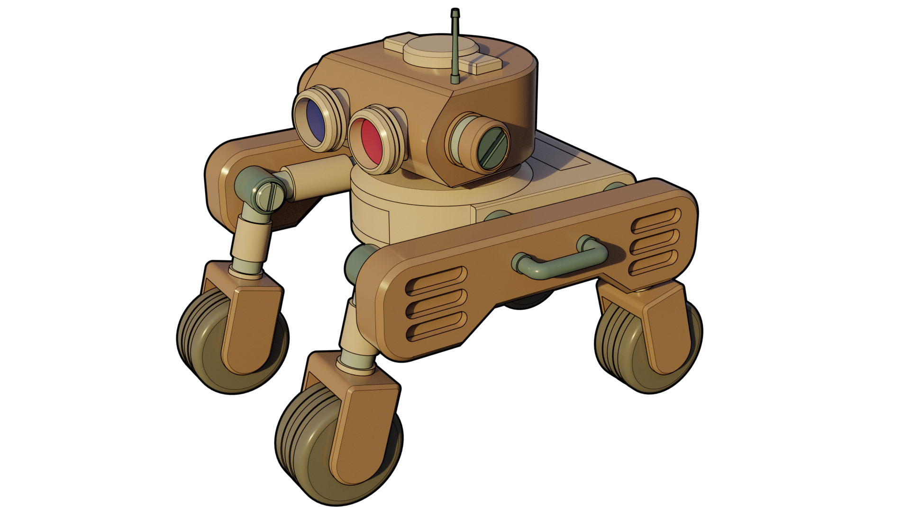

Procedural Storytelling-related Scripts, Datasets and Resources by Brett Kromkamp
=================================================================================

As the title implies, this repo is (will be) a collection of scripts, datasets, algorithms and resources that are especially relevant for procedural storytelling. Areas to explore include world-building, semantic modeling for narratives in general and procedural generation of plots and characters in particular. 

Useful Links
------------
* *Pending...*

How to Contribute
-----------------

#. Check for open issues or open a fresh issue to start a discussion around a feature idea or a bug.
#. Fork `the repository`_ on GitHub to start making your changes to the **master** branch (or branch off of it).
#. Send a pull request and bug the maintainer until it gets merged and published. :) Make sure to add yourself to AUTHORS_.

.. _the repository: https://github.com/brettkromkamp/procedural-storytelling
.. _AUTHORS: https://github.com/brettkromkamp/procedural-storytelling/blob/master/AUTHORS.rst
